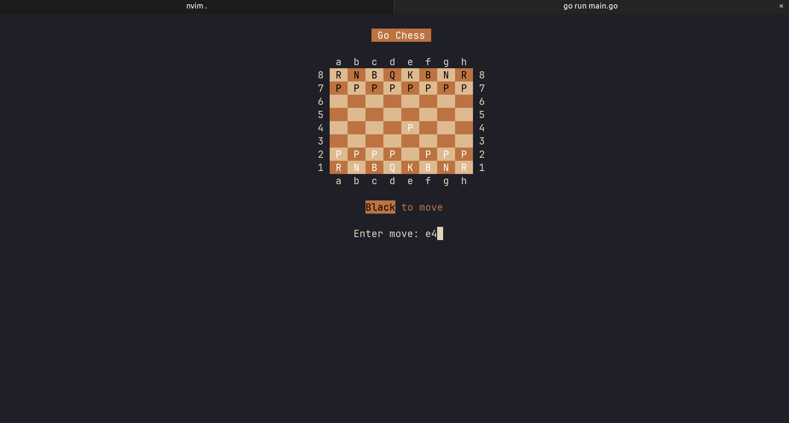

# TODO

- [x] Basic game loop to read from stdin
- [x] Display board and accept moves with [notnil/chess](https://github.com/notnil/chess)
- [x] Use [bubbletea](https://github.com/charmbracelet/bubbletea/tree/main) for TUI
- [ ] Graceful error handling for invalid moves
- [ ] Scrollable window with turn history
- [ ] Cursor on the board (maybe add possible moves highlight?)
- [ ] Piece movement with board interaction
- [ ] Stockfish as an opponent
- [ ] Online mode???

# Current TUI

